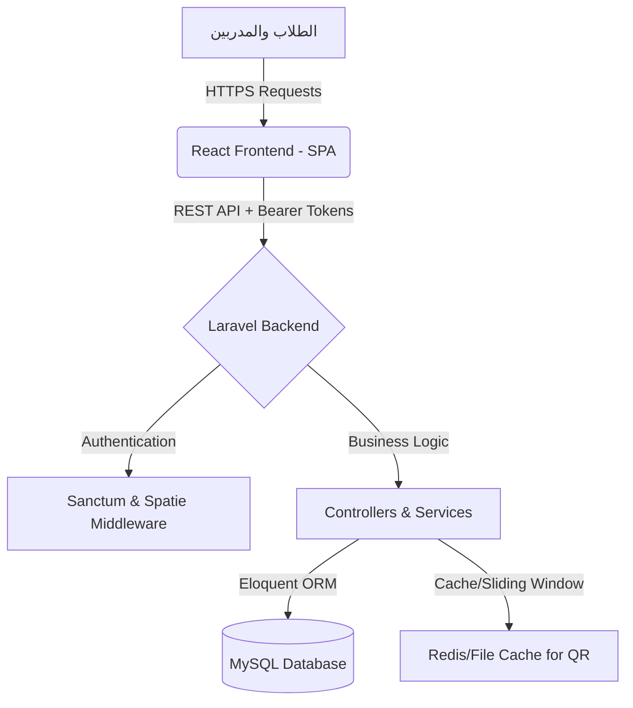

# منصة Elevate للتعليم الذكي (Elevate LMS) 🚀
**وثيقة تسليم المشروع الفنية والتقنية (Project Handover Documentation)**

---

## 1. نظرة عامة على المشروع (Project Overview)
منصة **Elevate LMS** هي نظام إدارة تعليم إلكتروني متكامل (Learning Management System) مبني بأحدث المعايير البرمجية. يهدف النظام إلى توفير بيئة تعليمية تفاعلية، آمنة، ومتقدمة تجمع بين الإدارة الأكاديمية الصارمة، والتجربة المرنة للطلاب والمدربين. تم تصميم النظام لدعم المؤسسات التعليمية من خلال أتمتة المهام كالتحضير، التقييم، وإصدار الشهادات.

---

## 2. التقنيات المستخدمة (Technology Stack)

> [!TIP]
> تم اختيار هذه التقنيات لضمان أعلى مستويات الأداء (Performance)، الأمان (Security)، وقابلية التوسع (Scalability).

| الطبقة (Layer) | التقنية (Technology) | الوصف والدور في النظام |
| :--- | :--- | :--- |
| **الواجهة الأمامية (Frontend)** | React.js (Vite) + TypeScript | بناء واجهات مستخدم تفاعلية، سريعة، وخالية من الأخطاء النوعية. |
| **تنسيق الواجهات (Styling)** | Tailwind CSS + Framer Motion | تصميم عصري متجاوب مع جميع الشاشات مع رسوم متحركة (Animations) سلسة. |
| **الخلفية (Backend)** | Laravel 11 (PHP 8.2) | معالجة البيانات، إدارة قواعد البيانات، وتوفير واجهات برمجة التطبيقات (RESTful APIs). |
| **قواعد البيانات (Database)** | MySQL | تخزين البيانات بشكل علائقي يضمن سلامة وترابط المعلومات. |
| **التوثيق والحماية (Auth)** | Laravel Sanctum + Spatie Roles | إدارة جلسات المستخدمين بنظام التوكن، وتوزيع الصلاحيات المتقدمة. |
| **مسح الأكواد (Scanning)** | HTML5 QR Code Scanner | مسح أكواد التحضير الحية باستخدام كاميرا الأجهزة المحمولة. |

---

## 3. المعمارية الفنية وسير العمل (Architecture & Workflow)



---

## 4. الميزات الرئيسية للنظام (Core Features)

### 👥 4.1. نظام الصلاحيات وإدارة المستخدمين (RBAC)
يحتوي النظام على نظام صلاحيات متعدد الطبقات:
*   **مدير النظام (Super Admin):** تحكم كامل في المنصة، الإحصائيات، والإعدادات المالية.
*   **المدير الأكاديمي (Academic Admin):** إدارة المناهج، الدورات، والتقارير الرقابية.
*   **المدرب (Instructor):** رفع الدروس، إدارة الحضور، وتقييم المهام.
*   **الطالب (Student):** تصفح المحتوى، حل الواجبات، والمشاركة في المجتمع التفاعلي.

### 📱 4.2. نظام التحضير الذكي المدعوم بالموقع (Smart Geo-fenced Attendance)
> [!IMPORTANT]
> يعتبر نظام التحضير من أقوى الميزات الأمنية في المنصة لمنع التلاعب.

*   **التشفير المتغير (Dynamic QR):** يقوم النظام بتوليد رمز QR مشفر يتغير كل **3 ثوانٍ** على شاشة المحاضر.
*   **النافذة الزمنية (Sliding Window):** خوارزمية ذكية تسمح بقبول الكود السابق لعدة ثوانٍ إضافية لمعالجة بطء الإنترنت لدى الطلاب دون المساس بالأمان.
*   **التحديد الجغرافي (Geo-fencing):** يطابق النظام إحداثيات (GPS) الطالب مع إحداثيات المحاضر لضمان وجود الطالب فعلياً داخل القاعة.

### 📝 4.3. التقييم والواجبات (Assignments & Grading)
*   يمكن للمدربين إنشاء تكاليف مع تحديد مواعيد نهائية (Deadlines).
*   نظام رفع ملفات آمن للطلاب لتقديم الواجبات.
*   إمكانية التقييم وإضافة تغذية راجعة (Feedback) من قبل المدرب.

### 💬 4.4. المجتمع التفاعلي (Course Community)
*   منتدى نقاش خاص بكل دورة.
*   نظام استطلاعات رأي (Polls) لجمع آراء الطلاب.
*   **نظام رقابة (Moderation):** سجلات رقابة إدارية (Moderation Logs) مع إمكانية حذف التعليقات المخالفة وحظر المستخدمين من المنتدى.

### 🎓 4.5. الشهادات المعتمدة (Verified Certificates)
*   إصدار شهادات آلية عند إتمام الدورة.
*   يتم ختم كل شهادة بـ (Hash) فريد يمنع التزوير.
*   رابط خاص للتحقق من صحة الشهادة من قبل جهات التوظيف.

---

## 5. التدابير الأمنية والوقائية (Security & Defense Mechanisms)

> [!CAUTION]
> تم بناء النظام بأساليب دفاعية (Defensive Architecture) لصد محاولات الاختراق أو التلاعب الأكاديمي.

1.  **منع مشاركة الحسابات (Device Fingerprinting):** يتم ربط حساب الطالب بمعرف الجهاز (UUID). لا يمكن للطالب تسجيل الدخول من جهاز آخر إلا بطلب "إعادة تعيين الجهاز" من الإدارة.
2.  **حماية المسارات (Route Protection):** لا يمكن جلب بيانات الـ QR برمجياً من قبل الطلاب، جميع المسارات الحساسة مغلفة بـ Middleware صارم.
3.  **الاستثناءات والمتطلبات (Prerequisites):** لا يمكن للطالب التسجيل في دورة متقدمة إلا بعد اجتياز الدورة السابقة، أو عبر تقديم طلب "استثناء أكاديمي" يتم مراجعته يدوياً من الإدارة.

---

## 6. متطلبات التشغيل (Deployment Requirements)

لرفع المشروع على الخادم (Production Server)، ستحتاج إلى:
*   خادم يعمل بنظام Linux (Ubuntu 22.04+).
*   PHP 8.2 أو أحدث.
*   Node.js (v18+) لبناء ملفات الواجهة الأمامية.
*   MySQL 8.0+.
*   خادم ويب Nginx أو Apache.

### أوامر البدء الأساسية:
**لتشغيل الخلفية (Backend):**
```bash
composer install
cp .env.example .env
php artisan key:generate
php artisan migrate --seed
php artisan storage:link
php artisan serve
```

**لتشغيل الواجهة الأمامية (Frontend):**
```bash
npm install
npm run dev
# للإنتاج (Production)
npm run build
```

---
*تم إعداد هذه الوثيقة لضمان الفهم الكامل والشامل للمشروع من الناحية التقنية والأكاديمية، وجاهزيته للعرض والتسليم النهائي.*
